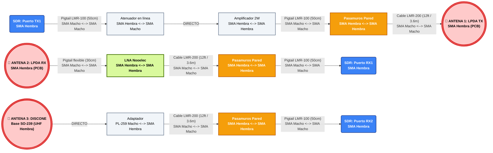
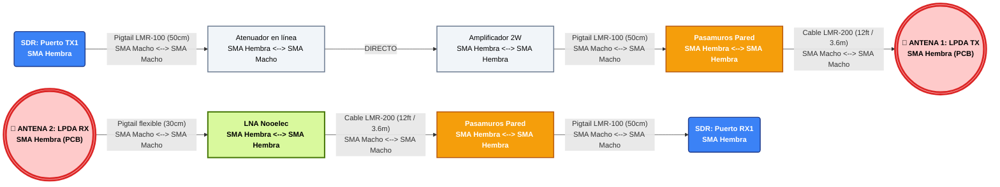

# Diagrama y Arquitectura del Enlace TVWS (Versión 5.1 - Ajuste Discone)

Arquitectura final hiper-optimizada. Todo el sistema utiliza el estándar SMA con cables LMR-200/LMR-100. Se incluye la corrección del adaptador específico para acoplarse directamente a la base de la antena Discone Tram 1411.

---

## 1. NODO GATEWAY (Base con Fibra)

---

## 2. NODO CLIENTE (Zona Rural)

